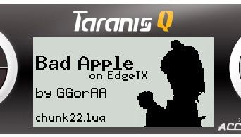

# Bad Apple .lua script for EdgeTX-powered radios

**TL;DR: It can play Bad Apple on the radio, but video chunk preparation/precompilation
is still hit-or-miss. Requires a port of the internal Lua compiler
over to the computer.**

This project allows playing a Bad Apple on an EdgeTX-powered radio,
and for now only tested on a Taranis Q X7. It _can_ run on a real
radio (not a simulator), but the precompilation step is still hit-or-miss.
Sometimes it successfully compiles video chunk files and the video plays,
sometimes it doesn't. The only way to fix this is to port over firmwares' internal
Lua compiler to the computer, and precompile everything there. Reason?
Welp, the only reason why precompilation is a hit-or-miss is lack of onboard
RAM. I _can_ configure the generator to output chunks with max 4.2 KB of size,
but the actual playback will be so laggy that audio will just lag behind video
(because video has mechanisms to catch up to speed, when audio doesn't) and
the actual playback experience will be very bad. I know that it _can_ play
chunks up to at least 7 KB, but it requires manual compilation, and is VERY
inconvinient because you don't want to manually compile ~350 files, like c'mon,
who would do that?

For now, there is no way to precompile on the computer, although I am
planning to introduce this to EdgeTX soon with a future PR.

**Simulator showcase: <https://youtu.be/IH8_Ke-uJ1Y>**

## Screenshot(s)

